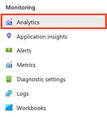
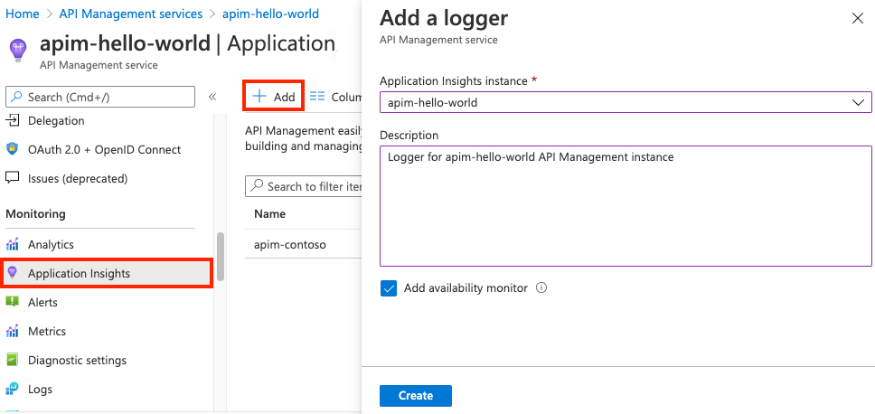
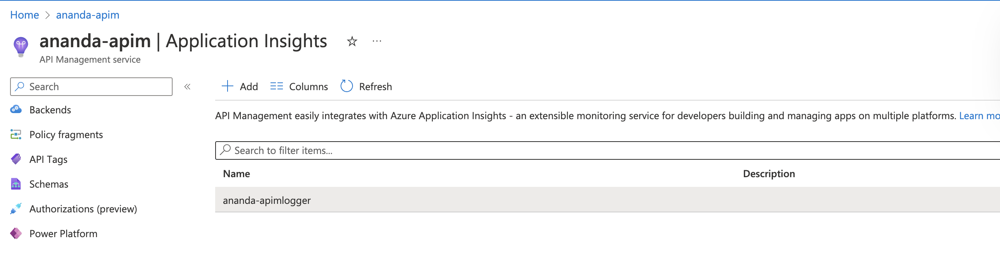
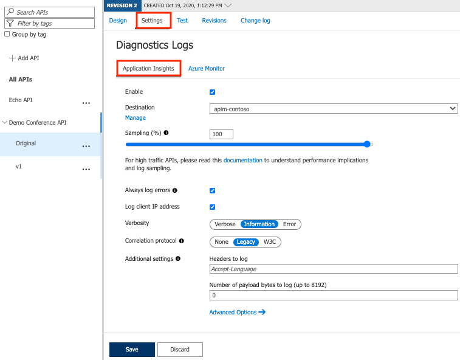
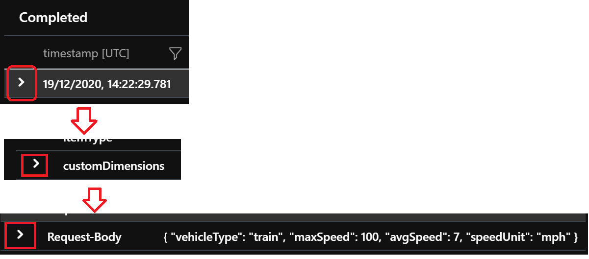

## Monitor and built-in API Analytics
Use the Azure portal to review analytics data at a glance for your API Management instance.
1. In the [Azure portal](https://portal.azure.com/), navigate to your API Management instance.
2. n the left-hand menu, under Monitoring, select Analytics.
 
* 

3. Select a time range for data, or enter a custom time range.
4. Select a report category for analytics data, such as Timeline, Geography, and so on.
5. Optionally, filter the report by one or more additional categories.

## Application Insight
Create a connection between Application Insights and API Management
1. Navigate to your Azure API Management service instance in the Azure portal.
2. Select Application Insights from the menu on the left
3. Select + Add.

4. Select the Application Insights instance you created earlier and provide a short description.
5. To enable availability monitoring of your API Management instance in Application Insights, select the Add availability monitor checkbox.
    * This setting regularly validates whether the API Management gateway endpoint is responding.
    * Results appear in the Availability pane of the Application Insights instance.
6. Select Create.
7. heck that the new Application Insights logger with an instrumentation key now appears in the list.


## Enable Application Insights logging for your API
### How to log request/response payload in Application Insights for APIs frontend by API Management
1. Go to [Azure Portal](https://portal.azure.com/) and navigate to the API Management resource
2. Select APIs from the menu on the left.
3. Click on your API, in this case Demo Conference API. If configured, select a version.
4. Go to the Settings tab from the top bar.
5. Scroll down to the Diagnostics Logs section.
6. Under Application Insights tab, tick the checkbox `Enable`

7. Select the AppInsights resource under `Destination` dropdown
8. Input 100 as Sampling (%) and select the Always log errors checkbox.
9. Verbosity `Information`
10. Correlation protocol `W3C`
11. Under Additional settings click `Advanced Options`
12. Tick to enable `Frontend Request` and `Frontend Response`
13. Use these settings for `Frontend Request`, `Frontend Response`,`Backend Request`,`Backend Respone`
    * Under Headers to log add the value `X-Forwarded-For`
    * Under Number of payload bytes to log (up to 8192) specify a value upto 8192 bytes
14. Hit save
15. Navigate to the `Application insights` resource and open the `Live Metrics` feature under `Investigate`.
16. Wait for a few minutes, under Application Insights >> Monitoring>> Logs run the following query
    ```text
    requests 
    | where url has "https://ananda-apim.azure-api.net"
    | where timestamp >= ago(1h)
    | order by timestamp desc

    ```
17. In the results grid, expand the result row, expand the customDimensions node and then expand the Request-Body node.
    
        
